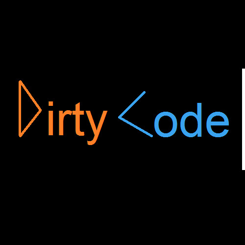

In the life of programmers, lines of code are something they interact with more than their own beds, more than the time they spend with their loved ones. So, is it worth regularly "cleaning up" those code segments during work?



<!--truncate-->

## Why is it called "dirty code"?

Actually, there is no concept of "dirty code" or "clean code"; I just use these terms to help everyone visualize the characteristics of those code segments, or even code files and projects.

For example, a code segment like the following in the classic language `C++`:

```cpp
int oddsum(int a[], int n)
{
  int s=0;
   for (int i = 0; i <n;i++)
  {
   if (a[i] % 2 == 1)
    {
    s = s+a[i];}
  }
return s;
}
```

The above code is a simple function to calculate the sum of odd numbers in an array with inputs being an array of integers and its number of elements.

The result is as expected because the syntax and logic are not wrong, but the above code has many issues, such as:

- Meaningless variable names
- No comments
- No input validation
- And especially, messy code formatting, inconsistent indentation, etc.

If working alone, using git alone with source code managed by yourself, this issue is not too significant.

But imagine looking back after 3, 4 months or even a year, would you dare to maintain such code that you yourself wrote?

And if you work in a team, this issue will become very difficult for other developers, especially when you are no longer in that team.
Many questions will arise when that happens: what is `a[]`, what is `n`???, and `s`????

That's just a code segment of less than 15 lines; so for a project with dozens or even hundreds of files, how difficult is it to maintain such code?

## Solutions to the above problem

"Clean code" is a term often used by coders and developers to describe code that is the opposite of the above, for example:

Of course, clean code is not just about naming variables reasonably or formatting code correctly, but it also includes designing the project structure or writing complete documentation, etc.

Therefore, this article only addresses clean code at a basic, simple, and easy-to-understand level, specifically within a few small functions in a code file.

### 1. Meaningful naming

Meaningful variable naming is one of the most important points in writing code because it helps readers understand the code more easily and maintain it more easily.

For me, I always have implicit conventions for naming variables, functions, classes, or even files right from the first line in the project, and many others do the same:

- For variables or attributes (properties in classes), they are usually defined with a meaningful noun, such as `fullName`, `age`, `number_of_wheel`.
- For variables, attributes of boolean type, they are defined with a meaningful noun and prefixed with `is`, `has`, `can`, etc., such as `isMale`, `hasWheel`, `can_fly`.
- For variables, attributes related to array, list, set, etc., they are defined with a meaningful plural noun or a noun with a prefix or suffix like `list`, `array`, `set`, etc., such as `students`, `car_list`, `setOfNumber`, etc.
- For function names (functions), method names (methods in classes), they are defined with a meaningful verb, such as `getFullName()`, `calculateAge()`, `get_number_of_wheel()`, `toggleLed()`.

Then, when looking at the code segments, you can more easily read the source code and have less headache when thinking of names for them.

### 2. Naming according to rules

Getting straight to the point, naming with syntax also follows some common conventions such as:

1. The `camelCase` rule: for example, `fullName`, `age`, `isMale`, `carList`, `calculateAge()`, `toggleLed()`, often used to name variables, functions, properties, or methods in most programming languages.
2. The `PascalCase` rule: for example, `Student`, `Car`, `CarList`, `CalculateAge()`, `ToggleLed()`, often used to name classes, interfaces, enums, structs, namespaces, or also used to name properties and methods in the C# programming language.
3. The `snake_case` rule, also known as `under_score`: for example, `full_name`, `age`, `is_male`, `car_list`, `calculate_age()`, `toggle_led()`, used similarly to `camelCase`.
4. The `kebab-case` rule: often used for naming files rather than naming variables, functions, or classes.

And of course, rules or conventions are also thought up by our "predecessors"; they are not laws. If you want to be creative, you can do it in style a or b, but make sure of the effectiveness of that "creativity."

### 3. Writing code according to standards

To call it "standard" is something no one dares to claim that this code is the most standard or beautiful because it is a characteristic that cannot be quantified, but I still want to talk about it because it is one of the important points in writing code.

For example, spaces, tabs, line breaks, semicolons, parentheses, etc., all need to follow a certain standard (format) so that when working together on a code segment, you and others will avoid issues like conflicts.

Nowadays, some modern IDEs/Text Editors often come with a built-in tool to format code according to standards, for example, Visual Studio Code has a built-in tool to format for many different languages. Or when you work with a project written in Javascript, Prettier is an indispensable tool.

Such tools help your code automatically indent, automatically add spaces, automatically add semicolons, automatically add parentheses, etc., in a reasonable, scientific, and aesthetically pleasing way.

### 4. Commenting code when necessary

Commenting code is something many people often overlook because it takes extra time during the coding process. But if the above methods still don't help you understand the code, it means those code segments are very difficult and cannot be more explicit, then commenting code will be the best solution.

With different languages, there are different ways to comment code, but the common purpose of commenting code is to explain to the reader of your code what that code segment does and why it does it that way.

Therefore, if you find that your own code can be difficult to read or not explicit, don't hesitate to add a few lines of text to explain to the next reader!

## Applying to the initial example

We have the theory; let's try to apply it to the "dirty code" above:

```cpp
// Function to calculate sum of odd numbers in an array
// Input: numbers - array of integers
//        size - size of the array
// Output: sum of odd numbers in the array
int calculateSumOfOddNumbers(int numbers[], int size)
{
  // Declare variable to store the result
  int result = 0;

  // Loop through the array
  for (int i = 0; i < size; i++)
  {
    // Check if the number is odd
    if (numbers[i] % 2 == 1)
    {
      result += numbers[i];
    }
  }

  return result;
}
```

Of course, applying too many rules to the small code segment above might seem a bit cumbersome, but it's just a simple example to show the difference between "dirty code" and "clean code."

## Conclusion

In reality, there are many more ways to clean code as I introduced at the beginning of the article; however, in this short article, I only focus on the methods that I find most useful and easiest to apply.

I hope this article will help you gain some experience to write better code and avoid "dirty code" errors.

If you have any questions or want to add more, please leave a comment below!

## Links

- Banner: [https://i1.sndcdn.com/avatars-000089054537-j37dkh-t500x500.jpg](https://i1.sndcdn.com/avatars-000089054537-j37dkh-t500x500.jpg)
