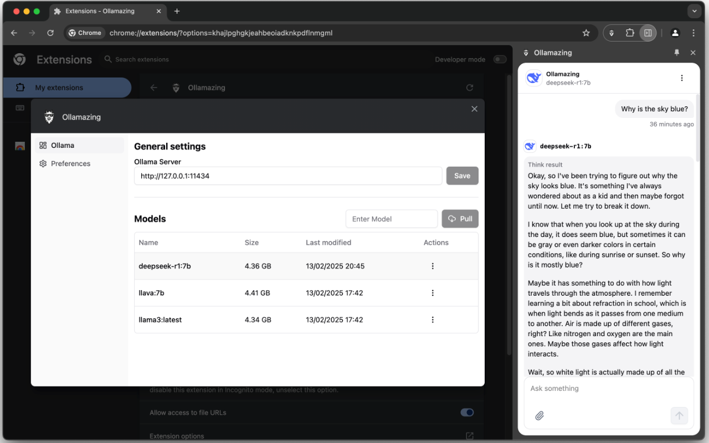

Hey fellow developers! 👋 I'm excited to introduce **Ollamazing**, a browser extension that brings the power of local AI models directly into your browsing experience. Let me share why you might want to give it a try.

## What is Ollamazing?

**Ollamazing** is a free, open-source browser extension that connects with **Ollama** to run AI models locally on your machine. Think of it as having ChatGPT-like (or even Deepseek for newer) capabilities, but with complete privacy and no subscription fees.

## 🌟 Key Features

1. 100% Free and Open Source
   - No hidden costs or subscription fees
   - Fully open-source codebase
   - Community-driven development
   - Transparent about how your data is handled
2. Local AI Processing
   - Thanks to Ollama, we can run AI models directly on your machine
   - Complete privacy - your data never leaves your computer
   - Works offline once models are downloaded
   - Support for various open-source models (_llama3.3_, _gemma_, _phi4_, _qwen_, _mistral_, _codellama_, etc.) and specially **_deepseek-r1_** \- the most popular open source model at current time.
3. Seamless Browser Integration
   - Chat with AI right from your browser sidebar
   - Text selection support for quick queries
   - Context-aware responses based on the current webpage
4. Developer-Friendly Features
   - Code completion and explanation
   - Documentation generation
   - Code review assistance
   - Bug fixing suggestions
   - Multiple programming language support
5. Easy Setup
   - Install Ollama on your machine or any remote server - don't forget to set up the \`OLLAMA_ORIGINS\`
   - Download your preferred models
   - Install the Ollamazing browser extension
   - Start chatting and using utilities with AI!

## 🚀 Getting Started

    # 1. Install Ollama
    curl -fsSL https://ollama.com/install.sh | sh

    # 2. Pull your first model (e.g., Deepseek R1 7 billion parameters)
    ollama pull deepseek-r1:7b

Then simply install the extension from your browser's extension store.

> For more information about Ollama, please visit the [official website](https://ollama.com/).

> **Important**: If you run Ollama on local machine, ensure to setup the `OLLAMA_ORIGINS` to allow the extension can connect to the server. For more details, read [Ollama FAQ](https://github.com/ollama/ollama/blob/main/docs/faq.md#how-do-i-configure-ollama-server), set the `OLLAMA_ORIGINS` to `*` or `chrome-extension://*` or the domain you want to allow.

## 💡 Use Cases

- Documentation generation
- Page content summary
- Document, Code review assistance

## 🔒 Privacy First

Unlike cloud-based AI assistants, Ollamazing:

- Keeps your data on your machine
- Doesn't require an internet connection for inference
- Gives you full control over which model to use
- Allows you to audit the code and know exactly what's happening with your data

## 🛠️ Technical Stack

- Use framework [WXT](https://wxt.dev/) to build the extension
- Built with React and TypeScript
- Uses Valtio for state management
- Implements TanStack Query for efficient data fetching
- Follows modern web extension best practices
- Utilizes Shadcn/UI for a clean, modern interface
- Use i18n for multi-language support

## 🤝 Contributing

We welcome contributions! Whether it's:

- Adding new features
- Improving documentation
- Reporting bugs
- Suggesting enhancements

Check out our GitHub repository [https://github.com/buiducnhat/ollamazing](https://github.com/buiducnhat/ollamazing) to get started!

## 🔮 Future Plans

We're working on:

- Enhanced context awareness
- Custom model fine-tuning support
- Improve UI/UX
- Improved performance optimizations
- Additional browser support

## 🚀 Try It Today!

Ready to experience local AI in your browser? Get started with Ollamazing:

- Chrome web store: [https://chromewebstore.google.com/detail/ollamazing/bfndpdpimcehljfgjdacbpapgbkecahi](https://chromewebstore.google.com/detail/ollamazing/bfndpdpimcehljfgjdacbpapgbkecahi)
- GitHub repository: [https://github.com/buiducnhat/ollamazing](https://github.com/buiducnhat/ollamazing)
- Product Hunt: [https://www.producthunt.com/posts/ollamazing](https://www.producthunt.com/posts/ollamazing)

Let me know in the comments if you have any questions or feedback! Have you tried running AI models locally before? What features would you like to see in Ollamazing?
